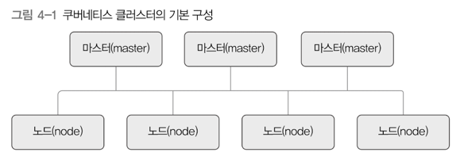
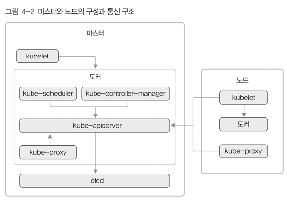

# 4. 쿠버네티스 아키텍처 
## 1) 쿠버네티스 클러스터의 전체 구조

- 쿠버네티스 클러스터의 구성
  - 마스터 : 클러스터를 관리
  - 노드 : 실제 컨테이너를 실행 

### 마스터 
- 실행되는 컴포넌트 리스트
  - etcd
  - kube-apiserver
  - kube-scheduler
  - kube-controller-manager
  - kubelet
  - kube-proxy
  - docker
  - etc

- 고가용성
  - 서버 3대 정도를 구성해서 운영하는 것이 일반적
  - 리더 마스터 1대 + 나머지 2대는 대기 
  - 리더 마스터 장애 -> 나머지 2대 중 1대가 리더 
  - 5대로 구성하기도

### 노드 
- 실행되는 컴포넌트 리스트
  - kubelet
  - kube-proxy
  - docker
  - etc

### 통신 구조 

- kube-apiserver
  - 쿠버네티스의 모든 통신의 중심 
  - 해당 서버를 거쳐서 다른 컴포넌트가 서로 필요한 정보를 주고 받음 
  - etcd에는 kube-apiserver만 접근 가능
- kubelet
  - 마스터에 있는 도커를 관리 
  - 관리용 컴포넌트들을 컨테이너로 실행 
  - 관리용 컴포넌트 모두는 하이퍼큐브라는 바이너리 파일로 컴파일되었고, 실행할 때 옵션을 설정해 각 컴포넌트의 역할을 수행함
- etcd 
  - 컨테이너가 아닌 별도의 프로세스로 설정
- 노드의 kubelet
  - 마스터의 kube-apiserver와 통신하면서 pod의 생성, 관리, 삭제를 담당함 
  - 노드의 kube-proxy는 마스터와는 다르게 컨테이너가 아니라 서버 프로세스로 실행 가능 (컨테이너도 가능)

## 2) 쿠버네티스의 주요 컴포넌트 
> 쿠버네티스는 근본적으로 클러스터를 관리 
> 